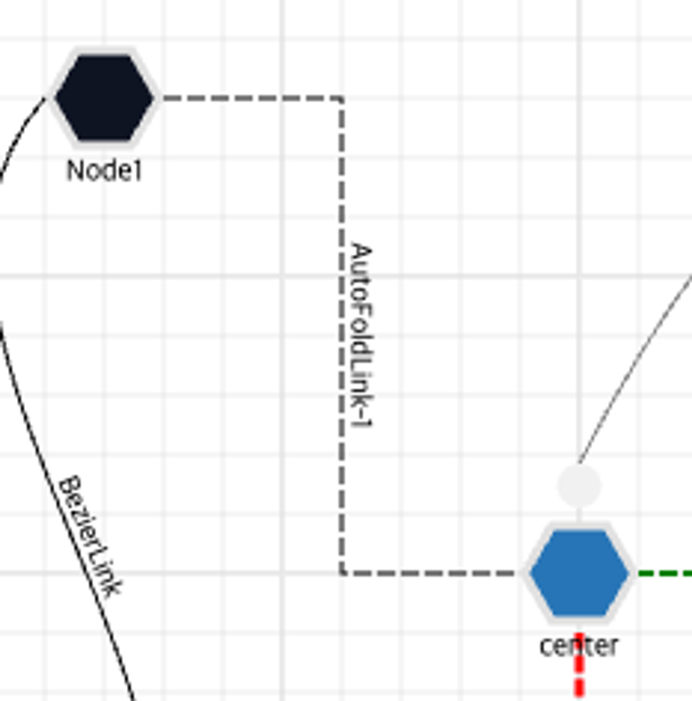

# **Topology 구현 중 네트워크 토폴로지에 특화되어 있는 Jtopo 라이브러리 테스트**

## **Jtopo 특징**

우선, Jtopo는 중국에서 만들어진 토폴로지 전용 Javascript 라이브러리다. 

공식 사이트에 따르면, Jtopo는 Drag & Drop을 통해 토폴로지를 직접 구성하고 저장 및 업데이트 하는 것에 특화되어 있는 라이브러리이다. 데모를 할 수 있는 워크스페이스가 따로 있는데 거기서 JS 코드로 작업을 하면 그에 맞게 토폴로지가 하나의 캔버스 위에 구현이 되는 것을 알 수 있다. 

현재 팀에서 구현 예정인 DiagOps, SetOps 등에 대한 토폴로지 제작을 위해 Jtopo를 활용하고자 하는 의견이 나왔고 검증을 위해 테스트 중에 있다. 그런데 위 공식사이트에 있는 내용이 좀 걸린 채 테스트를 진행하였는데 아니나 다를까 아래 몇 가지 문제점들을 발견했다.

## Jtopo 문제점 (vs. D3.js)

- 다양한 토폴로지를 구현하는 데에 특화되어 있는 D3.js (이 라이브러리는 굉장히 대중적이기 때문에 추후에 깊게 다룰 예정이다.)와 몇가지 차이점이 있는데 그 중 하나가 Jtopo는 D3.js와는 달리 가상 DOM이 없다는 점이다.
    - D3는 가상 DOM이 있기 때문에 노드를 추가할 때 D3에 내장된 속성들을 활용하여 간단하게 구현만 해주면 자동으로 연결이 되지만, Jtopo의 경우 가상 DOM이 없기 때문에 코드를 하나하나 다 구현해줘야해서 시간과 노력이 더 필요하다. 이 때 문제는 한 두개의 노드면 그냥 해주면 되겠지만 토폴로지 구현할 때는 그게 아니기 때문에, 동적으로 데이터를 받아와 그때 그때 다른 형태의 토폴로지를 브라우저에 띄워야하는 현재 상황에는 맞지 않은 라이브러리라고 생각한다.
- 또한 아래와 같이 데모 코드에서는 제대로 구현이 되지만 실제 Vue3에 적용했을 때는 제대로 css적용이 안되는 것을 알 수 있다.
- 마지막으로 중국에서는 모르겠지만 한국에서는 npm download 수가 두자리밖에 안될정도로 전혀 대중적이지 않은 라이브러리이기 때문에 커뮤니티 및 문서화가 상대적으로 규모가 작기 때문에 개발시 큰 어려움을 겪을 것 같다.

### svg animation - 같은 코드 적용시 차이점

#### Jtopo 데모사이트 화면 - 애니메이션 적용 o


#### iZero 테스트 화면 - 애니메이션 적용x


## **Jtopo 속성 및 메서드 정의**

### 메서드
#### ✓ AutoFoldLink (점선 애니메이션 메서드)
```jsx
const autoFoldLink1 = new AutoFoldLink('AutoFoldLink-1', node1, node0, 'rm', 'lm')
```
위 코드에서 node0과 node1은 각각 new Node()라는 Jtopo의 클래스를 통해 새롭게 생성한 노드들이고, 해당 노드들을 연결하기 위해 AutoFoldLink를 활용한 것이다. 

첫 번째 파라미터로는 text명, 두 번째, 세 번째는 노드의 변수명, 마지막 두개는 두개의 노드들을 연결하는 링크의 속성을 설정하기 위한 파라미터들이다. 



<br>

## **Vue에서 실제로 사용해보기**

> 회사에서 디자이너 분이 디자인하신 토폴로지를 직접 구현한거기 때문에 보안상 그대로 코드 노출은 불가하다.

### 코드 조각

#### 💡Point
> Jtopo 자체가 코드로 직접 토폴로지를 짜는것보다 drag and drop에 특화되어 있는 라이브러리라서 직접 일일이 코드로 입력해야 하는 부분이 상당히 많다.

#### 🚨 문제점
> 예를 들어, 특정 구역들을 나눈 뒤 그 안에 있는 구역이 다른 각각의 자녀 요소들을 이어주는 AutoFoldLink 메서드를 사용할 때, 해당 링크 중앙에 특정 아이콘을 삽입하는 디자인이 있었다. 근데 그 중앙 포지셔닝을 하는데에 어려움이 있는게, 각 자녀 요소들은 부모요소들 안에 있는게 기본값이기 때문에 x값이 0으로 측정된다. 따라서 중앙값을 구하기에 어려움이 있어서 우선은 절대값으로 지정해놨는데 이부분은 나중에 동적인 데이터를 받았을 때 문제가 되기때문에 해결책을 찾아야한다.

아래코드 극히 일부분이다. (참고용)

```jsx
const cloudIconMiddle = new Node('', -5, -95, 48.25, 48.25);
cloudIconMiddle.setImage(
    'https://email-form-images.s3.ap-northeast-2.amazonaws.com/ic-internet.svg',
    500
);
cloudIconMiddle.zIndex = 9999;

const subnet8 = new Node('', 590, 255, 65, 65);
subnet8.setImage(
    'https://email-form-images.s3.ap-northeast-2.amazonaws.com/loadBalancer-green.svg',
    500
);
subnet8.zIndex = 9999;

const cloudIconBottom = new Node('', 590, 195, 48.25, 48.25);
cloudIconBottom.setImage(
    'https://email-form-images.s3.ap-northeast-2.amazonaws.com/ic-internal-green.svg',
    500
);
cloudIconBottom.zIndex = 9999;


```


## Jtopo Tech - Background 따로 깔아서 보이게 하는법 & topology 요소들 Lock 설정 & Toolbar 숨기기

> 우선 이 구현을 하는 이유는 Map Topology를 구현하기 위해 필요한 단계이기 때문인데, Global Map을 Background에 깐 후 그 위에 Jtopo Canvas를 가져올거라서 Jtopo의 Canvas 배경을 투명하게 만들어야한다. 또한 topology 요소들이 draggable이 불가능하게 lock 설정을 해서 고정된 background 위의 핀들이 움직이지 않도록 해야한다. 마지막으로, toolbar은 굳이 필요없기도하고 육안상으로도 보기 좋지 않기때문에 숨기는게 좋다고 판단했다.
> 

### Background 따로 깔아서 보이게 하는법

이건 처음에는 :deep()이라는 css 메서드를 활용해보려 했지만 아예 적용이 되지 않아서, DOM을 활용했다.

canvas 태그가 2개이기 때문에 우선 querySelectorAll로 모두 가져와서 골라서 설정하기로 했다.

```jsx
const canvas = document.querySelectorAll('canvas');
canvas[1].style.background = 'none' // 1번째 요소에 해당하는 canvas가 조작하고자 하는 canvas임을 파악함.
```

위와 같이 설정하면 canvas background가 투명해져서 맨 밑에 배경으로 둔 map이 잘 보이게 된다.

### Topology 요소들 Lock 설정

이 부분은 약간의 시행착오가 있었는데 draggable이라는 속성을 false로 두면 된다고해서 되지 않아서 확인해보니, layer.addChild()부분이 실행되기전에 draggable을 false로 설정해서 이후에 추가되었던 child 부분들은 draggable 설정이 적용되지 않은 것이었다. 그래서 addChild 메서드가 모든 실행된 후 마지막 부분 draggable 설정하는 부분을 추가했고, 추가적으로 각각의 노드가 아닌 전체 노드 또한 움직이면 안되기때문에 layer 통으로도 draggble 설정을 주었다.

```jsx
.
.
.
layer.addChild(node4) // 마지막 addChild

layer.children.forEach(child => { // 각각의 노드에 draggable 설정하기
	child.draggable = false;
})

layer.editable = false;
layer.draggable = false;
```

### Toolbar 숨기기

이건 쉽다. 그냥 메서드 하나만 딱 사용하면 간단하게 숨겨진다.

```jsx
const stage = new Stage(divObj)

stage.hideToolbar();
```